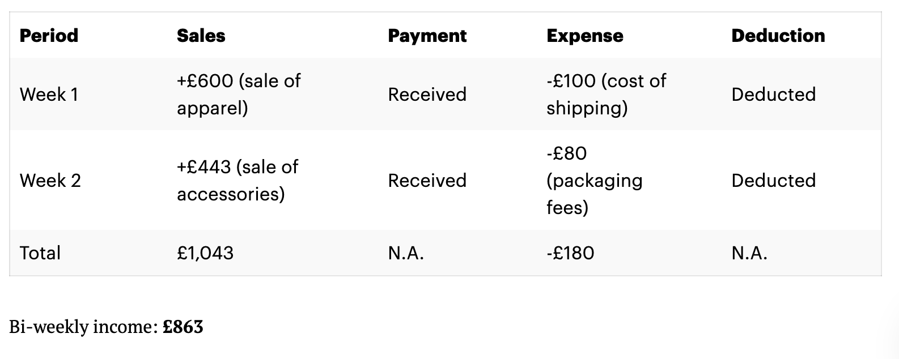
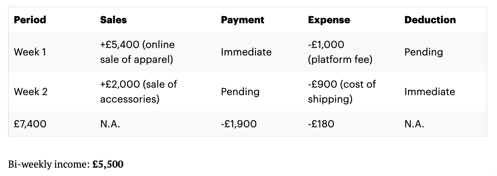

You've jumped aboard the e-commerce bandwagon and set up your own business. Congratulations! Unfortunately, however, you can't just sit back, relax, and wait for the sales to pour in.

If you want to build a successful long-term e-commerce business then you need to get to grips with [e-commerce accounting](https://osome.com/uk/accounting/ecommerce/). 

This is slightly different to ‘regular' accounting. Therefore, even if you do have some accounting knowledge, it's still worth getting up to speed with e-commerce-specific requirements.

Let's explore the key takeaways that you need to be aware of going forward.

## What's the Difference Between E-Commerce Accounting and Traditional Bookkeeping?

First things first, let's clarify something: [accounting](https://osome.com/uk/accounting/) and [bookkeeping](https://osome.com/uk/bookkeeping-services/) aren't the same things. 

Bookkeeping refers to a single subset of your accounting duties: Making sure your books are in order. In other words, that you've recorded all transactions, expenses in a neat, well-organised set of accounts. 

This is crucial work. However, it's just a fraction of what accountants actually get up to.

Accountants use their professional expertise to take your set of accounts before:

- Filing all relevant paperwork on your behalf;
- Answering any tax-related enquiries;
- Providing forward-thinking financial forecast;
- Advising on growth strategies.

In fact, that's just scratching the surface. The best accountants [act as trusted business advisors](https://www.cpapracticeadvisor.com/small-business/news/21081683/86-of-smbs-view-accountants-as-trusted-business-advisors), helping business owners cut through the numbers to figure out how their business is really performing. 

But wait—surely this is the same for regular and e-commerce businesses, right?

Wrong.

E-commerce businesses have their very own rules, regulations, and requirements to be aware of. However, no accountant can work their magic if they have to contend with messy, confusing records.

So before we dive in and look at e-commerce-specific accounting requirements, let's first quickly run through how you can keep an accurate record for your e-commerce business.

## The 2 Approaches to Keeping Accurate Records for Your E-commerce Business
Both of these methods work equally well, though one may be more suitable for your particular business based on its individual context and requirements. Let's examine what each method involves.

### Cash-based Accounting System
A cash-based system means that you only ever record sales and expenses once the money enters/leaves your bank account. If a customer purchases a good for you, you wouldn't record this transaction until the money has actually hit your account.  

This is how a cash-based accounting record might look:

<figure>

<figcaption>Example of cash-based accounting record</figcaption>

</figure>

So who should use this method? Well, it's not limited to any one specific type of business—though it's generally used by government agencies, non-profit organisations, community associations, and small service businesses. This is largely due to the fact that these businesses don't sell goods or services on credit, and they typically pay bills as soon as they are incurred.

### Accrual-based Accounting System
Alternatively, you could opt to use an accrual-based accounting system. This records transactions as soon as they take place, rather than waiting for the money to arrive or leave your bank account.

Larger businesses generally follow this system as it makes it significantly easier to handle a large volume of transactions and a complex, ever-growing inventory.

<figure>

<figcaption>Example of accrual-based accounting record</figcaption>

</figure>

#### Sales

As you can see above, the company earned £5,400 in the first week after selling online apparel—this money was immediately transferred over to the company's business bank account. 

Great.

However, in week 2, the customer made an order for £2,000 but has not been paid up till the 3rd week. This has yet to be deposited into the company account, but it's still recorded at the point-of-sale (though including a small addendum mentioning that payment hasn't yet arrived in the company's account).

#### Expenses

£900 worth of shopping costs immediately left the company's business bank account in week 1, though the £1,000 platform fee from selling apparel isn't due until next month. Therefore, this money will remain in the company's account for the time being—however, records should state that this expense was indeed incurred (and is due in a month's time). 

Accrual-based accounting might initially seem confusing. However, in the long run, you will gain a more holistic view of your company's finances. This method offers an easier way to manage both account receivables (i.e. the money that you've yet to receive) and accounts payable (costs that you've yet to incur but are due to pay). 

By having a firmer grasp over these two areas, you can make more informed, sounder financial decisions going forward. Fortunately, you don't have to keep accrual-based records manually. Instead, let technology handle most of the work for you. 

If you're ready to get started, just schedule a free demo with a member of Osome's expert team.

### The 3 Keys to Successful E-Commerce Accounting
You can't shut up your e-commerce store for the night. If it's successful, you'll be receiving a high volume of transactions on a rolling, 24-hour basis. Amidst this chaos, you need to make sure that you stay on top of the key e-commerce accounting requirements.

There are three main areas that you need to get comfortable with.

- Locating your transactional data

For e-commerce businesses, their transactional data is usually located at the backend of your selling channel (rather than within your credit card statements or bank accounts). With traditional accounting methods, accountants and bookkeepers report the deposits that are reflected within your business's bank account. 

However, this doesn't apply to e-commerce businesses. Here's what you instead need to focus on:

#### Income and Other Important Figures
Your business bank account isn't necessarily an accurate reflection of your profit. Why's this? Well, it'll likely include multiple transactions relating to a wide range of additional areas: sales, returns, sales tax, chargebacks, and shipping borne by your customers. 

If you want to accurately record your income then it's crucial that you look beyond your bank account, instead diving into the backend of your selling platforms to note the precise breakdown of your sales and other transactions. 

Example: Leonard's business bank account reflected a net deposit of £6,000 in December. Leonard doesn't record this as income—instead, he does a little digging into each transaction and identifies that his actual monthly income was £5,139. 

#### Transactional Timings
Pay close attention to the timings of transactions, as your “net deposit” shown in your bank records won't necessarily be reflective of your actual sales date.

Example: Christabelle sold her iPhone 12 pro Max on Amazon on December 24th, 2020. However, Amazon only processed the transaction on January 9th, 2021. She records the transaction date as the 24th December, even though she received payment at a later date, as recording the actual date will help keep her records accurate—thereby allowing her to make better-informed decisions going forward.

- Managing your Inventory

Inventory is the fuel powering successful e-commerce businesses. It's crucial that you maintain a full picture of the units of inventory that you possess at any given time in order to accurately track your inventory cost. 

There are two primary methods that might help you with this:

##### Periodic inventory tracking
This method is pretty basic, yet laborious. Essentially, it means that you have to periodically count every unit of inventory and manually record each item's cost or sale value. Then, once you've updated your records, you have to also update your cash flow sheet to stay on top of the total amount that your company has spent and gained regarding its inventory.

There's no set frequency with which you have to do this—it entirely depends on your business's size and complexity. You might be able to complete this on a monthly basis when you are just starting out, but as your business grows, you might have to track your inventory on a quarterly (or even annual) basis). 

##### Perpetual inventory tracking
This method is far simpler and more effective. Basically, you leverage automated accounting software to continually track your business's levels of inventory. The software automatically refreshes the figures (inventory count, purchase account, and overall cash amount) as and when necessary. 

If you can, we'd advise that you opt for this method.

- Understanding the Costs of Goods Sold (COGS)

Costs of Goods Sold (COGS) refers to how much it costs your business to sell a product: production/manufacturing costs, storage costs, shipping costs, etc. 
This figure is [calculated slightly differently](https://corporatefinanceinstitute.com/resources/knowledge/accounting/cost-of-goods-sold-cogs/) according to which accounting method you follow. However, it's crucial that you maintain a firm grasp over your COGS when looking to grow your e-commerce business, as your gross margin equals the costs of goods sold minus how much you actually sell an item for.

## Difficulties of e-commerce Accounting
### The complicated process of inventory management
Managing inventory is a complex process. You have to stay on top of the amount of stock currently in production, in transit to you, in a shopper's cart, or pending returns. 

And when your business grows, this becomes even more difficult.

You'll have to contend with rising numbers of product SKUs, transactions, marketplaces, and countries, among other challenges. 

### Keeping up with sales tax liability
If you're lucky enough to grow your business to the stage where it's turning over more than £85,000 per year, then you'll have to register for Value-Added Tax (VAT)—as well as charging this additional tax on all the goods that you sell. 

VAT is generally set at 20%, but there are some variations according to the precise nature of your goods and services. Consider consulting the [HMRC website](https://www.gov.uk/guidance/rates-of-vat-on-different-goods-and-services) for more guidance.

### The impact of transaction volume on your accounting system 
A higher volume of transactions means more data points to manage. Therefore, consider batching transactions on a daily, weekly, bi-weekly, or even monthly basis to avoid overwhelming your accounting system.

## If in doubt, leave it up to the experts
There's a lot to manage when running your own e-commerce business. This is made even harder when you consider that:

- Amazon statements have 150+ types of charges. 
- Facebook sales run on Shopify. 
- Stripe dumps receipts from your website in a different format altogether. 

Every line demands a different VAT figure depending on whether you sold the goods at home or overseas.

If you'd rather focus on growing your business than keeping up with its accounting requirements, don't worry—that's why we're here. 

Here at Osome, we've produced the ultimate [accounting service for your e-commerce business](https://osome.com/uk/accounting/ecommerce/). Choose the plan that works for you and get started right away. Contact us now to begin your journey.