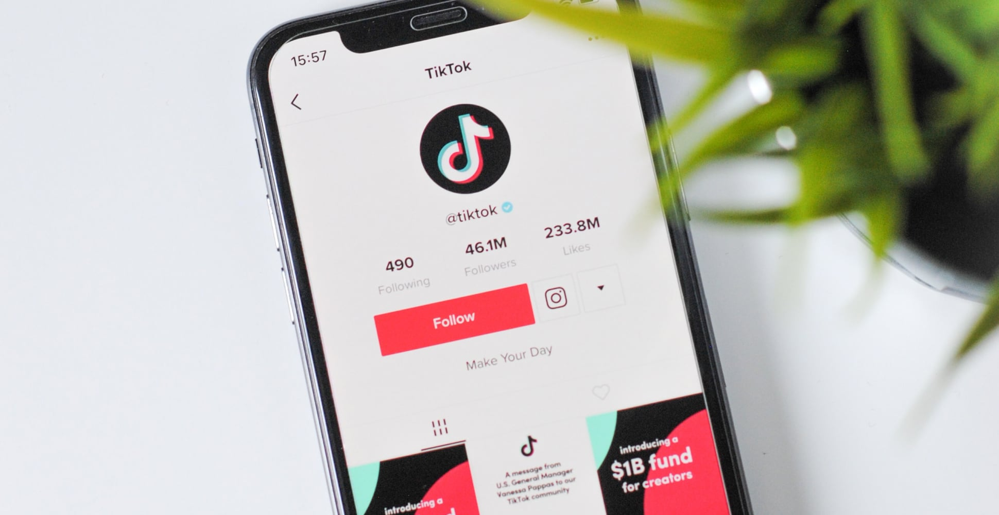

At [CRKLR](https://crklr.com/) and [Outfund](https://out.fund), we focus on helping challenger ecommerce brands rapidly grow through paid search, social, owned and earned media and on-demand, non-dilutive funding respectively. We’ve pulled together some of the most unique features of 2022 peak including what to expect and how you can win, even at the last minute!

This year’s peak trading for ecommerce is going to be influenced by a number of factors that diverge from previous years. We are facing a year which is dealing with an accelerated shift to e-commerce post-pandemic, a pending worldwide economic downturn, the football World Cup and a privacy-centric future. 

And that’s just for starters…

## Football’s Coming Home…

You might be wondering what on Earth the Qatar 2022 Football World Cup has to do with peak trading if you are an ecommerce business. 

Let’s consider this for a second:

**Start date:** 20th November
**End date:** 18th December 

Sounds great - lots of entertainment if you are a football fan, but this is also the first time that a world cup, probably the biggest sporting event in the world, is on at the same time as peak trading. 

In a year where many ecommerce businesses are already struggling due to a perfect storm of supply chain issues and media disruption, this could cause further problems. 

Let’s think about this further and take a look at what is going to happen to your core media channels.

#### Google Search

Traffic is dependent on specific searches and the world cup is unlikely to have an impact on product search, primarily due crossover and reduced audience attention to purchasing. For instance, at day event level, Google predicts a surge in demand of circa 15% and as much as 24% in categories like outerwear. However the World Cup event impact is a reduction in demand of 10-11% in these categories. Over the season, the world cup is predicted to actually increase demand by 10%; it’s the cross-over with peak that’s an issue, so go early or stay later. 

#### Meta (Facebook & Instagram)

Meta allows gambling ads which means that in a year where CPMs have already seen inflation in many categories, ecommerce companies may struggle to find affordable ad space if limited to only Meta. CPMs have started to come down with benchmarks indicating that they are on track with 2021 for the first time, which might alleviate some impact.

<figure>

</figure>

#### TikTok

TikTok does not facilitate gambling ads. This is something of a safe haven, and you may even see some benefits in terms of dual screening as an entertainment platform. If your audience is 18-24 years old, then hopefully you are on the platform already. Again, audience distraction could be an issue but we do know how sticky TikTok is and it’s likely that it will be able to leverage content around the World Cup as a result.z

#### Snapchat

It hasn’t been the best year for Snapchat with profit warnings and staff cuts, but the platform remains popular with younger audiences - it actually has higher usage than Instagram for teenagers. They have very shrewdly agreed a [deal ](https://www.cityam.com/scoring-gen-z-attention-snap-teams-up-with-sky-sports-in-new-content-deal/)with Sky Sports to stream highlights of the Premiership and Qatar World Cup. This could act as a beacon for user growth and engagement, and could present some opportunities for those with the right customer demographic.

### Our Recommendations

#### Media Diversity

At perhaps more than any point in the last 10 years, it is essential that digital spend is diversified. There is actually a genuine opportunity to see success at scale outside of Google and Facebook; TikTok, Snapchat, and Pinterest command substantial reach, and programmatic display is seeing a resurgence at the moment for larger advertisers.

#### Effective Testing

Ensure that you are conducting efficient testing, and that you can quickly expedite and scale. If you are a fashion brand, you may not be able to compete with gambling brands who can command a much higher LTV, and who by extension are willing to pay a lot more for users. Therefore, it’s best to test and find the platforms and audiences that offer the lowest competition and best efficiency.

**Easily Transferable Content**

Make sure you have (ad) content that can easily be moved between platforms to avoid competition - note how standardised ad formats are becoming, and how easy it is to edit these between platforms. 

#### Utilise the World Cup

Leverage the World Cup as well as traditional retail events such as Black Friday and Cyber Monday, especially with owned and earned media.  Gamify content and discounting based on the national teams’ performance, and use popular hashtags to your advantage.

## The Elephant In The Room (TikTok)

We’d be doing you a disservice if we failed to mention TikTok and its major marketing potential for peak trade. Since its launch 7 years ago, the social entertainment app has been on a stratospheric trajectory, surpassing 1 billion monthly users in September 2022 - a marketing goldmine when executed correctly. 

TikTok has radically altered both the _way_ we consume, and the _content _we consume; we can see a major shift towards short form, naturalistic content, as Facebook, Instagram, and YouTube all push out their own imitations of TikTok’s format with limited success, as reported by [WSJ.](https://www.wsj.com/articles/instagram-reels-tiktok-meta-facebook-documents-11662991777)

One of the elements which has made TikTok so successful is its authenticity. It’s what has allowed people to rise through the ranks of fame based purely on the act of daily vlogging, online book clubs, or thrift hauls. TikTok shows us a little slice of someone else’s life and we eat it up. This is why TikTok is a great place to collaborate with influencers and generate valuable UGC (which we shall touch upon in the next section). 

It is also a valuable platform for you to show off brand personality and to cultivate a following of people who not only relate to what you sell, but to _who you are_. Perfection is out, realism is in. The reason TikTok is such a great place to grow an audience is because of its major organic reach and potential for virality; the average organic reach for brands on TikTok is about 118%, which is staggering when compared to Facebook’s organic reach of about 5.2%.

### Ok, so TikTok is an essential platform, but what should brands be posting on TikTok?

TikTok’s own motto for brands is ‘Don’t Create Ads, Create TikToks’ -  and believe it or not, they are right! It is easy for brands to get sucked into the idea that everything posted on social media has to be clean cut and a hard sell, but this doesn’t work for TikTok - ultimately, it is for entertainment, and native short form video content is the way forward. Here are some key pointers to get you started.

#### **Know your Brand**

Understanding your brand identity is really important, but equally important is considering how your customer base views you. A stellar example of this is RyanAir (whoever runs their TikTok account is a mastermind!). They _know_ that they are a budget airline who offer cheap, accessible flights. They also, it seems, are acutely aware of how they are received by the general public and use this to their advantage. Instead of trying to change people’s perceptions, their presence on TikTok wholly revolves around [embracing their stereotype](https://vm.tiktok.com/ZMFATcTVm/). And it consistently delivers results - 2.3 million likes on one video is not to be laughed at.

#### Keep Updated on Trends

TikTok’s algorithm is ever changing to incorporate the newest trends and sounds. It is important that you keep updated so that you don’t miss out on an opportunity for more exposure. One example is the [Game of Thrones ](https://vm.tiktok.com/ZMFATofED/)account utilising a trending House of Dragons sound (if you’ve been on TikTok at all in the last few weeks, we’re sure we know your new drink of choice). Repurposing the sound was a clear and clever move, as it directly relates to their brand and serves both series with a publicity boost. Keeping on top of trends might feel tiring, but consumers respond - in fact,[ 61% of users](https://www.tiktok.com/) like brands more when they create or participate in a trend.

#### Familiarise Yourself with TikTok’s Creative Studio

It goes without saying that to make the most of the app, you need to know how to use it.** **Black Country Living Museum is a perfect example of a company that knows what its purpose is, and has learned how to use TikTok to reap the rewards. Their [high quality content](https://vm.tiktok.com/ZMFAToLYf/) paired with snappy transitions and trend participation makes for a successful pairing that has given them 1.2million followers.

### Our Recommendations

#### Get Started

Ensure that you have a presence on TikTok by setting up a business account. If you have short-form video available, then this is a starting point, so begin by seeding it with whatever your team can find as long as it is authentic.

#### Set-up A TikTok Store

If you are on Shopify or Shopify Plus, then the TikTok sales channel native integration makes it very easy to set-up a shop and configure your store and pixel - this makes product discovery much easier.

#### Use Existing Influencer Relationships

If you have influencers that you work with on other channels, then the chances are that they have a presence on TikTok as they are likely seeing more growth and engagement there. Reach out and ask them to create some TikToks.

#### TikTok Ads

The platform is best known for its amazing organic engagement, but paid ads can offer fantastic results and huge reach. One of the best features is the targeting options that can be deployed (competitor hashtags, purchase intent, etc). There are so many opportunities that it can seem daunting at first, but the ads interface is fast and easy to use. Worst case scenario, hire a pro to get started.

## **Influencers**

The concept of ‘influencers’ is nothing new. However, who has access to becoming one has shifted hugely due to the likes of Instagram and, again, TikTok. With a niche for every market, it is easy to find someone who matches your brand identity. You are more likely to see results if you choose to collaborate with someone whose following resembles your own. 

For peak trade in 2022, working with influencers can offer some advantages. One is that you will not be impacted by increased auction demand caused by the 2022 World Cup, which will affect some platforms. On top of this, when executed as part of a social commerce strategy, optimised influencer content can yield uplift on product discovery.

User-Generated Content may still feel like a daunting shift for some when compared to tried and tested branded content, but statistically its worth is evident. In a [Stackla survey](https://www.businesswire.com/news/home/20190220005302/en/Stackla-Survey-Reveals-Disconnect-Between-the-Content-Consumers-Want-What-Marketers-Deliver),  79% of people said that UGC highly impacts their purchasing decisions, while only 13% say branded content is an influencing factor. [Another survey ](https://www.adsmurai.com/en/articles/user-generated-content-ugc-more-effective-sales#:~:text=User%2Dgenerated%20content%20is%2042,from%20your%20social%20media%20advertising.)showed that users viewed UGC content as 42% more effective than branded content. 

It seems that, unsurprisingly, consumers trust consumers. Product validation is essential, so seeing someone else use a product with a positive outcome will sway people’s spending habits.

As well as raising brand awareness, UGC campaigns also give you a mountain of content which you can repurpose into ads. And UGC makes _great_ ads. Meta reported an uplift of up to 7% when using repurposed UGC content and here at [CRKLR](https://www.crklr.com) we have seen much higher outcomes when optimising UGC across ad sets based on engagement. In fact, this is a key aspect of our social ad format structures, along with optimised product feeds.

### Our Recommendations

#### Embrace the Power of the Micro Influencer

They are more likely to respond well to gifting and partnerships - plus you might be able to find someone more specific to your niche. It’s fine going for creators with large followings, but if their followers aren’t linked to your customer base, you could end up missing out.

#### Have goals for your content

We suggest around 6-10 pieces of product-based content. It is also useful to be specific about what kind of content you want eg. review, styling, challenge, how-to, etc.

#### Make Sure you have Usage Rights

This one speaks for itself - you don’t want to miss out on repurposing material because you’ve neglected to secure permission to use it.

#### Use UGC Across All Channels

If it’s great content, why hide it? Use it across Meta, TikTok, Snapchat and even Google Ads (via YouTube).

#### Credit the Influencer

Include their handle in your ads so that they can grow their audience alongside you - it’s a win-win situation and makes negotiations a lot easier.

## Product Search

Paying attention to product search is essential to your marketing strategy and cannot be undervalued. In 2022, just 30% of product search was performed on search engines worldwide according to [Statista](https://www.statista.com/statistics/1034209/global-product-search-online-sources/), with the top destination being leading local marketplaces such as Amazon and Etsy. Social media now accounts for 23% which is considerable, and reflects the move to social commerce.

This year due to the squeeze on household incomes, we predict that people will be conducting extensive research to make sure that they are getting the most out of their money. As a result, it has never been more important to ensure that your products are competitively priced and visible, no matter where people are searching. Hint: it’s not just Google.

 

While search engine use remains strong, it is by no means the only method people use to discover new products. Perhaps unsurprisingly, Pinterest is now marketing itself as the third biggest search engine! Consider how Pinterest is performing alongside its social media peers, as it is one of the few to report positive growth and earnings metrics; you can see that they are committed to their brand and function, with a great long-term strategy. They aren’t chasing trends, or sacrificing any part of their identity which makes them uniquely _Pinterest._

That said, other forms of social media are also growing rapidly as resources in search, especially when targeting younger users like Gen Z. According to a [GlobalWebIndex](https://www.searchenginewatch.com/2020/11/20/how-social-media-influence-71-consumer-buying-decisions/) study, 54% of people on social media use social media platforms to research products, so it is well worth your time optimising search in these spaces too. 

### Our Recommendations

#### Ensure You’re on Pinterest

Set up boards and configure your business and shop properly. They have recently released updates in their Trends tool, which makes it much easier to target potential customers with ads too - essential work in peak trade. Even without any promotion, product pins can deliver traffic and sales.

#### Set up Instagram Shopping and TikTok Shop

[49% of Gen Z consumers](https://blog.hubspot.com/marketing/social-media-product-research) prefer to discover new products via Instagram Stories and[ 71% of purchases on TikTok](https://www.thedrum.com/opinion/2022/05/11/how-tiktok-revolutionizing-the-way-we-speak-sell-and-shop) are unplanned - so it is crucial that you are able to facilitate an easy purchase journey no matter where your product is found. 

#### Ensure Your Product Feeds are Optimised

Consider the titles and descriptions of your products eg. include details like the colour and size etc. Factor in time to do thorough keyword research, it will pay off! And make sure your product feeds contain as many data fields as possible to ensure efficient optimisation.

#### Optimise Product Images For Social

One massive learning curve we had this year was that using lifestyle images for product ads resulted in significantly better CTR and lower acquisition costs for our clients . If you sell belts, don’t have a picture of a belt with a white background, show someone wearing it! 

#### Ensure You Make Full Use of Annotations on Google Shopping

We recommend reviews if you have these available. Google usually has a 2 week approval process for product reviews if using a 3rd party aggregation service, so there is still time! Expect to see a significant improvement in CTR with review ratings in place.

## Be Brave (But Know Your Metrics!)

Fortune favours the brave and peak 2022 could present an opportunity to accelerate growth - not just in terms of immediate revenue, but also future revenue through growing first party data. This is essential for life in a cookieless future. 

Peak trading generally means discounts and that eats into already squeezed margins. If you are giving away 20% or more over Black Friday and Cyber Monday, then you may well be operating at a loss given the increases to CPMs on some channels and the inflated cost of acquisition. 

To some extent, you can box cleverly and sell on brand values with sustainability playing an increasingly important role in consumer purchasing. 

Beyond this, knowing your metrics is critical, especially Lifetime Value (LTV). If you have an established business and product lines, then you should have a good understanding of AOV, average gross margin, and repeat purchase behaviour.  This means that you can work to CAC rather than purely ROAS, which is one-dimensional. 

For example

* AOV = £100
* Average customer repeat purchase behaviour is 1.4x/year 
* LTV = £140 (1.4 x £100)
* Average Margin = 20% (allowing for discounting at peak)
* Target CAC = £28

This is less restrictive than looking at a pure ROAS model which would rely on 5X ROAS to break-even or a £20 CAC.

However, when considering this through the lens of LTV,  ROAS can be much lower, with the above example working out at 3.6X ROAS and a higher CAC target of £28. The difference being that we are looking beyond a single purchase.

Please note that this is extremely simplistic as an example and factoring in additional costs such as CRM, return rates and customer segmentation is critical to building a robust model. The point is that looking beyond ROAS is essential to planning for growth. 

If you don’t have the funding to support aggressive growth, this is where revenue based funding from [Out.fund](https://www.out.fund) can help. 

### Our Recommendations

#### Know LTV

Ideally extend this beyond the above example and take into account 2 year churn, CRM, and remarketing costs.

#### Split Campaigns into New and Existing

This is a key benefit of social media, as you can exclude existing customer segments and therefore have different CAC for new or existing customers at campaign level, as well as messaging to support. Google also enables different bidding with Performance Max for new and existing customers.

#### Invest

Revenue based financing means that you can invest over peak without having to dilute ownership. 

## Let’s Reflect

Peak trading in 2022 is going to be unlike any other year before and possibly even after. There is considerable change and opportunity emerging within media, and marketing teams, that are agile and data driven, can reap the rewards. 

For many, resources or funding can be a road block but there are options here to outsource, either through agencies or via specialist freelancers. Funding has also changed and lenders like OutFund now open opportunities for exciting and ambitious brands to expedite growth without dilution. 

Whatever your plans, it’s not too late to diversify your marketing and make sure you have an amazing end to 2022. 

## About the Author

Justin Thomas is an award winning marketer, agency entrepreneur, guest speaker, self-confessed nerd and founder of CRKLR, the agile digital marketing agency. 

[www.crklr.com](https://www.crklr.com)

[www.linkedin.com/in/crklrdigitalmarketing](https://www.linkedin.com/in/crklrdigitalmarketing) 
