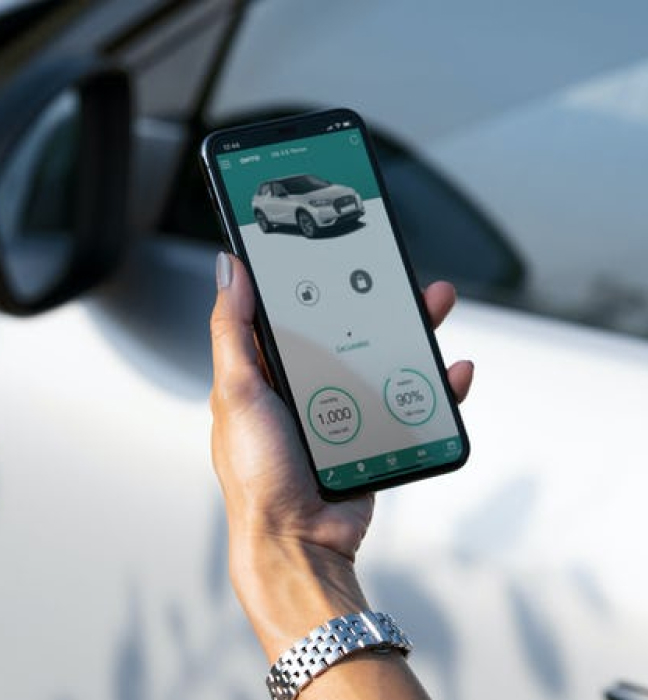
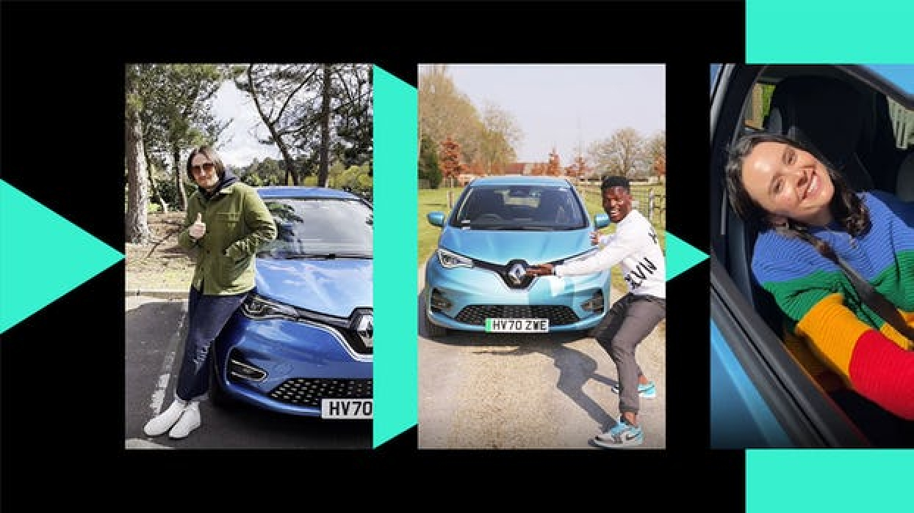

<Text>

Prior to setting up ONTO, Rob worked for 5 years at Jaguar Land Rover. Initially, taking the concept of an electric vehicle subscription service to JLR’s in-house business incubator was quickly recognised as having significant limitations as a JLR captive company.

Rob was given approval to develop the idea outside of JLR, and left to form ONTO in 2017. They offer all-inclusive electric vehicle subscriptions on a monthly rolling contract, providing all the benefits of car ownership with none of the hassle.

</Text>

<PhotoStrip>

</PhotoStrip>

<ChalangeSolution 
  chalange={{
    title: "Their Challenge", 
    text:"ONTO had a large backlog of orders and needed the funding to expand their fleet of electric cars."
  }}
  solution={{
    title: "Outfund’s Solution", 
    text:"Outfund was able to provide fast and flexible funding to allow them to fulfil orders and meet demand."
  }}
/>

<Quote text="We have doubled in size in the last quarter and are due to double in size again this quarter!" by="Rob Jolly" role="Founder of ONTO" />

## Where Are They Now?
Since ONTO joined Outfund, they have been growing at an exponential rate, and is now the UK’s largest fleet of electric vehicles, which has enabled his business to double in size in the last quarter, and is on track to double again every six months. They’re now gearing up to do a large Series B fundraising round. Rob is extremely excited about ONTO’s growth since they joined Outfund.
